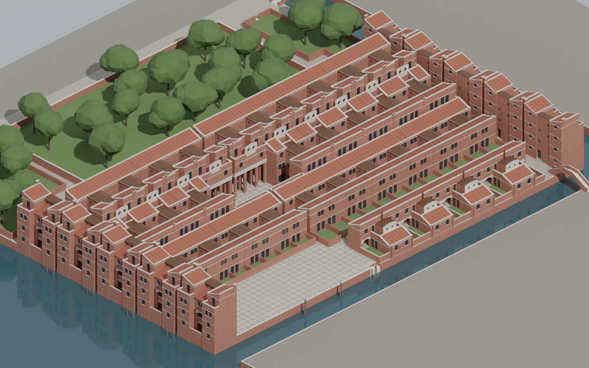

# Residenze IACP alla Giudecca — 3D model

A 3D model of Gino Valle's public housing on the Giudecca, Venice ("Alloggi
Giudecca, Area Trevisan", IACP, executive drawings 1984–85). It covers the whole
complex: the 10 towers standing in the water, the "tappeto" (three rows of
H-houses with the campo), the "schiera" (four blocks of row houses), the
square, the gardens and the surrounding canals and bridges.

The model was built from the 89 drawings and photos in [`plans/`](plans/) with
the [3D modelling skill](.claude/skills/jasonkneen-3d-modeling/). Blender
scripts generate every element from measured parameters.

**Interactive viewer (in the browser):** <https://claude.ai/artifact/Vrd1miXQrTRSVZizKNNhCV> (private until the owner shares it from the page's Share menu)



## What is in the repository

| Folder | Contents |
|---|---|
| [`plans/`](plans/) | The 89 original drawings and photos. [`plans/INDEX.md`](plans/INDEX.md) lists every sheet with its content. |
| [`docs/ANALYSIS.md`](docs/ANALYSIS.md) | The building specification derived from the drawings: grid, levels, roof rule, every part with its dimensions and the drawing each value comes from. |
| [`model/export/`](model/export/) | **The finished model**: `.glb`, `.fbx`, `.obj` + `.mtl`, the Blender file `.blend`, the two textures and preview renders. |
| [`model/giudecca/`](model/giudecca/) | The Python/Blender code: `params.py` (all dimensions), `towers.py`, `carpet.py`, `schiera.py`, `site.py`, plus shared geometry, materials, textures, validation and rendering. |
| [`model/build.py`](model/build.py) | Builds, checks and exports the whole model. |

## Opening the model

* **In the browser:** the viewer link above. You can orbit, cut through the
  floors and switch parts on and off.
* **Windows:** double-click `model/export/SM_Giudecca_IACP_Valle.glb`; it opens
  in "3D Viewer".
* **macOS:** open the `.glb` with Apple's free Reality Converter.
* **Any glTF viewer online,** for example <https://gltf-viewer.donmccurdy.com/>:
  drag the `.glb` file onto the page.
* **Blender (free, blender.org):** open `SM_Giudecca_IACP_Valle.blend`. The
  objects are grouped in collections by part (Towers, Carpet, Schiera, Site).
* **Rhino, SketchUp, 3ds Max, ArchiCAD and similar:** import the `.fbx` or the
  `.obj`. Keep the `.mtl` and the two `T_*.png` files in the same folder as the
  `.obj`.

To download a single file from GitHub, open it and click "Download raw file".
To download everything, use "Code → Download ZIP" on the repository page.

## Units and orientation

* 1 unit = 1 metre. ±0.00 is the ground floor; the paving lies at −0.45 and
  the water at −2.50.
* North is +Y in Blender and −Z in glTF; east is +X.
* The planning grid has a module of 1.65 m. `docs/ANALYSIS.md` §2 explains how
  the drawings' axis numbers map to model coordinates.

## Model summary

| | |
|---|---|
| Objects | 310 meshes in 15 materials (brick, concrete, copper, clay tiles, glass, …) |
| Triangles | ≈ 119,000 |
| Buildings | 119.5 × 65.1 m; highest copings 13.12 m (north row, towers) |
| Floors | 0.00 / 3.01 / 6.02 / 9.02 m |
| Textures | 1024 × 1024 px per metre of brick and of roof tiles, world-scale UVs |

Every build checks the model against the skill's rules: correct names, applied
transforms, no n-gons, closed (manifold) meshes, outward normals, UVs and
materials on every object. It also reports overlapping faces between objects.
The results are in `model/export/build_report.json`.

## How accurate is it?

The geometry follows the 1:50 and 1:200 executive drawings: plans, sections,
elevations and details. Plan cuts, sections and elevations of the model were
overlaid on calibrated scans of the drawings, and they match within about
0.1–0.3 m. The things the drawings don't settle, and how the model handles
them, are listed in `docs/ANALYSIS.md` §9. The main simplifications are:

* Interiors are not modelled (no rooms, internal stairs or doors). The model
  shows the building's exterior, its courts, porticoes and terraces.
* Windows are simple: glass set back in the reveal, with mullions only where
  the drawings show them.
* Surroundings (gardens, canals, bridges) are simplified. Neighbouring
  buildings are left out.

## Rebuilding the model

You need Python 3.11 and Blender as a Python module:

```bash
python3.11 -m venv venv && . venv/bin/activate
pip install bpy==5.0.1 numpy
python model/build.py --render       # writes model/output/ (≈ 20 s; renders ≈ 10 min on a CPU)
python model/build.py --only towers  # build a single part
```

All dimensions are in `model/giudecca/params.py`. Change a value there and
rebuild.

---

## Kurzanleitung (Deutsch)

**Was ist das?** Ein 3D-Modell der Wohnanlage von Gino Valle auf der Giudecca
in Venedig. Es wurde aus den 89 Plänen im Ordner `plans/` erstellt.

**Modell ansehen:**

1. **Am einfachsten im Browser:** den Viewer-Link oben öffnen. Mit der Maus
   drehen, mit dem Mausrad zoomen. Rechts kann man Ansichten wählen,
   Geschosse aufschneiden und Bauteile ein- und ausblenden. Der Link ist
   zunächst privat; andere können ihn erst öffnen, wenn du ihn auf der Seite
   über „Teilen“ freigibst.
2. **Datei herunterladen:** im Ordner `model/export/` auf
   `SM_Giudecca_IACP_Valle.glb` klicken, dann auf „Download raw file“. Unter
   Windows öffnet ein Doppelklick die Datei im „3D-Viewer“.
3. **Mit Blender (kostenlos):** `SM_Giudecca_IACP_Valle.blend` herunterladen und
   öffnen.
4. **Für Rhino, SketchUp, ArchiCAD usw.:** die `.fbx`- oder `.obj`-Datei
   importieren. Bei `.obj` die `.mtl`-Datei und die beiden `T_*.png`-Bilder in
   denselben Ordner legen.

**Maßstab:** 1 Einheit = 1 Meter, ±0,00 = Erdgeschoss.

**Alles auf einmal herunterladen:** auf der Startseite des Repositorys
„Code → Download ZIP“ wählen.
